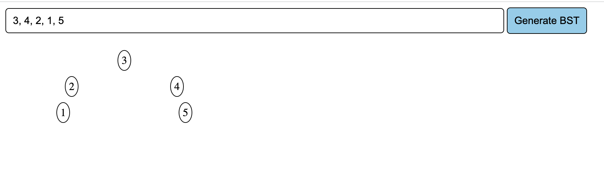

# binary-search-tree-js

## Description

This is a binary search tree implementation in JavaScript.
The first entered number is the root, the values lesser than the root go to the left and the values greater than the root go to the right.

## Usage

There is a textbox that accepts comma separated values. There is a button called `Generate BST` that when clicked after entering values, generates the BST.

## Example

On entering the values `3, 4, 2, 1, 5` and clicking the `Generate BST` button, the following BST is generated:

